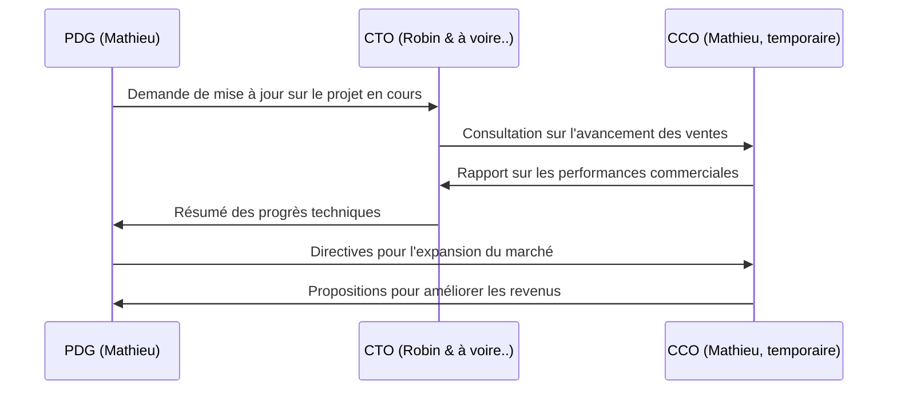
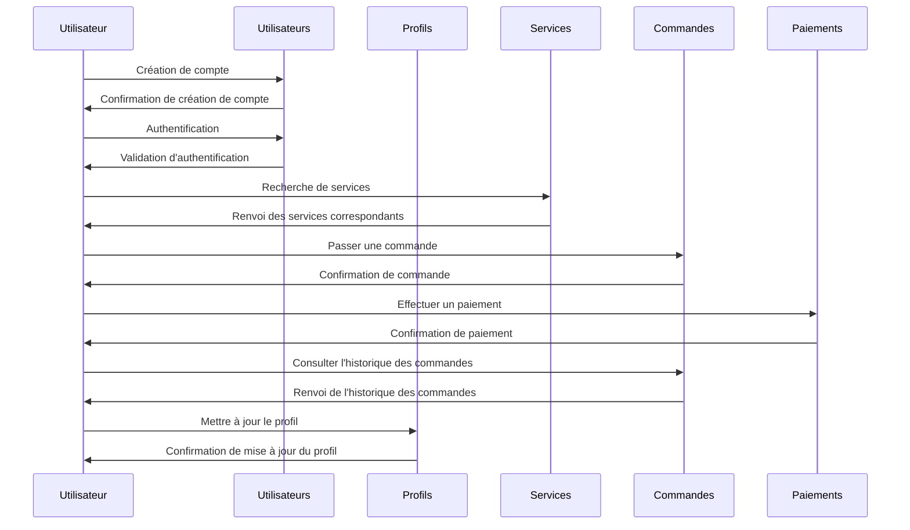


# Le Bon Beat

# Sommaire :

## 1. Organisation de l'entreprise

-   ### 1.1 Postes & structure

    -   1.1.1 Organigramme de la structure
    -   1.1.2 Rôles
-   ### 1.2 Réunions & organisation
    
    -   1.2.1 Réunions & emplois du temps
-   ### 1.3 Lois & statuts d'entreprise
    
    -   1.3.1 Législation, etc...

## 2. Concept du projet

-   ### 2.1 Introduction :
    
    -   Brève introduction
-   ### 2.2 Description du projet :
    
    -   Développement détaillé des aspects et caractéristiques du projet.
-   ### 2.3 Problématique :
    
    -   Identification des problèmes ou des besoins que le projet cherche à résoudre.
-   ### 2.4 Objectifs :
    
    -   Énonciation des objectifs
-   ### 2.5 Proposition de valeur :
    
    -   Mise en avant de la proposition de valeur unique du projet.
-   ### 2.6 Avantages et bénéfices :
    
    -   Discussion des avantages et des bénéfices pour les parties prenantes.
-   ### 2.7 Méthodologie :
    
    -   Description brève de l'approche ou de la méthodologie envisagée pour le projet.
-   ### 2.8 Plan d'exécution :
    
    -   Esquisse du plan d'exécution **dans l'ordre** avec les principales étapes et délais.
-   ### 2.9 Risques potentiels :
    
    -   Identification des risques possibles et stratégies d'atténuation.
-   ### 2.10 Conclusion :
    
    -   Résumé des points clés et de l'importance du concept du projet.

## 3. Développement de la plateforme

-   ### 3.1 Technologie utilisée
    
    -   3.1.1 Présentation du framework Django et Base De Données
    -   3.1.2 Configuration & installation
-   ### 3.2 Base de données
    
    -   3.2.1 Structure de la base de données & schémas
    -   3.2.2 Sécurité des données
    -   3.2.3 Gestion des migrations
-   ### 3.3 Serveur
    
    -   3.3.1 Hébergement & localhost
    -   3.3.2 Configuration du Serveur Web
    -   3.3.3 Sécurisation du Serveur
-   ### 3.4 Structure du site
    
    -   3.4.1 Arborescence client
    -   3.4.2 Arborescence serveur
    -   3.4.3 Pages, fichiers & fonctions
        -   3.4.3.1 UI et UX
        -   3.4.3.2 Schéma fonctionnel des requêtes
-   ### 3.5 Déploiement
    
    -   3.5.1 Configuration du serveur
    -   3.5.2 Stratégies de déploiement (AWS)
    -   3.5.3 Surveillance et maintenance

#

# 1. Organisation de l'entreprise
## 1.1.1 Organigramme de la structure

## 1.1.2 Rôles
## Administratif
-  ### **PDG** Mathieu
	- à faire..
## Commercial
-  ### **PDG** Mathieu
	- à faire..
## Dévloppement
-  ### **CTO** Robin
	- à faire..
## 1.2 Réunions & organisation
- a faire...
## 1.3 Lois & statuts d'entreprise
- a faire...
# 2. Concept du projet

### 2.1 Introduction :
   -   à faire...
### 2.2 Description du projet :
    
   -   à faire...
### 2.3 Problématique :
    
   -   à faire...
### 2.4 Objectifs :
    
   -   à faire...
### 2.5 Proposition de valeur :
    
   -   à faire...
### 2.6 Avantages et bénéfices :
    
   -   à faire...
### 2.7 Méthodologie :
    
   -   à faire...
### 2.8 Plan d'exécution :
    
   -   à faire...
### 2.9 Risques potentiels :
    
   -   à faire...
### 2.10 Conclusion :
    
   -   à faire...
# 

# 3. Développement de la plateforme
## 3.1 Technologie utilisée
### 3.1.1 Présentation du framework Django et Base De Données
- **Django** est un framework python rapide et simple supportent tout aussi bien les petit project que les grande insrastucture, Django convient parfaitement pour ce project qui sera en évolution constante.

-  **MySQL** de part ca rapidité et documentation ainsi que sa compatibilité avec Django MySQL s'impose comme un choix évident pour la base de donné.

- **AWS** sûr et extensible, convient bien.

- **GitHub** servira de cloud et de gestionaire pour le projet. 

- **Ubuntu** OS de dévloppement

### 3.1.2 Configuration & installation
Pour travailler efficacement, il est important de travailler dans un environnement similaire.

#### 1. installé ubuntu
##### 1.1. Téléchargement de l'image ISO

1. Allez sur le site officiel d'Ubuntu : [https://ubuntu.com/download](https://ubuntu.com/download)
2. Choisissez la version d'Ubuntu que vous souhaitez installer (par exemple, Ubuntu Desktop LTS).
3. Sélectionnez votre architecture système (64 bits recommandé).
4. Cliquez sur "Télécharger" pour obtenir le fichier ISO.

##### 1.2. Création d'une clé USB bootable

1. Téléchargez et installez un logiciel de création de clé USB bootable comme Rufus (pour Windows) ou Etcher (pour Windows, macOS, et Linux).
2. Branchez une clé USB vide d'au moins 4 Go sur votre ordinateur.
3. Lancez Rufus ou Etcher, sélectionnez l'image ISO d'Ubuntu que vous avez téléchargée.
4. Choisissez votre clé USB comme périphérique de destination.
5. Cliquez sur "Démarrer" pour créer la clé USB bootable.

##### 1.3. Configuration du BIOS/UEFI

1. Redémarrez votre ordinateur et accédez au BIOS ou à l'UEFI en appuyant sur la touche correspondante (généralement F2, F10, ou Suppr) au démarrage.
2. Dans les paramètres du BIOS/UEFI, modifiez l'ordre de démarrage pour démarrer à partir de la clé USB en premier.
3. Sauvegardez les modifications et quittez le BIOS/UEFI.

##### 1.4. Installation d'Ubuntu

1. Insérez la clé USB bootable dans votre ordinateur et redémarrez-le.
2. Lorsque l'écran de démarrage apparaît, choisissez "Installer Ubuntu" à partir du menu.
3. Suivez les instructions à l'écran pour choisir votre langue, votre fuseau horaire, votre disposition de clavier, etc.
4. Lorsque vous arrivez à l'étape "Type d'installation", choisissez "Installer Ubuntu aux côtés de [votre système d'exploitation actuel]" ou "Effacer le disque et installer Ubuntu" selon vos besoins.
5. Configurez votre nom d'utilisateur, votre mot de passe et d'autres paramètres selon vos préférences.
6. Attendez que l'installation soit terminée. Une fois terminée, redémarrez votre ordinateur.

##### 1.5. Finalisation de l'installation

1. Après le redémarrage, retirez la clé USB.
2. Ubuntu devrait démarrer à partir du disque dur.
3. Suivez les instructions à l'écran pour terminer la configuration initiale, comme la connexion à un réseau Wi-Fi et les mises à jour du système.

### 2. installé Visual Studio Code (Nous allons biento transitionée sur Pycharm.)
#### 2.1. Téléchargement du paquet .deb

1.  Ouvrez un terminal en appuyant sur `Ctrl + Alt + T`.
2.  Téléchargez le paquet .deb de Visual Studio Code en utilisant wget :
      `wget -O vscode.deb https://go.microsoft.com/fwlink/?LinkID=760868` 
    

#### 2.2. Installation du paquet .deb

1.  Une fois le téléchargement terminé, installez le paquet .deb en utilisant dpkg :
	 `sudo dpkg -i vscode.deb` 
    

#### 2.3. Installation des dépendances manquantes (si nécessaire)

1.  Si vous rencontrez des erreurs de dépendances lors de l'installation, exécutez la commande suivante pour installer les dépendances manquantes :  `sudo apt-get install -f` 
    

#### 2.4. Lancement de Visual Studio Code

1.  Après l'installation, lancez Visual Studio Code en utilisant la commande suivante :`code` 

###  3. Setup le projet depuis GitHub
#### 3.1 installée GIT
- ouvré un terminal et entré: `sudo apt update` puis `sudo apt upgrade` puis `sudo apt install git`
- une fois cela terminé vérifié l'installation de git avec: `git --version`, cela devrais vous affiché la version.
- une fois git installé, installé Python: `sudo apt install python3.11`
- ensuite, installé pip: `apt install python3-pip`
- une fois les étape précédente réalisé, clonner le projet: `git clone https://github.com/desboisGIT/LeBonBeat.git`
- vous devriez avoir un dossier LeBonBeat crée, une fois dans le dossier il y a: `WebPage/` et `requirements.txt`
- entrée: `source .venv/bin/activate` puis `pip install -r requirements.txt`
#

## 3.2 Base de données
    
## 3.2.1 Structure de la base de données & schémas

### Tables de la Base de Données :
---
### Table Utilisateurs
| Utilisateurs (Users) |                                                   |
|-----------------------|---------------------------------------------------|
| user_id               | Clé primaire                                      |
| username              | Nom d'utilisateur                                |
| email                 | Adresse e-mail                                    |
| password_hash         | Hash du mot de passe                             |
| role                  | Rôle de l'utilisateur (Beatmaker ou Artiste)      |
| date_registered       | Date d'inscription                               |
---
### Table Profils
| Profils (Profiles)   |                                                    |
|----------------------|----------------------------------------------------|
| profile_id           | Clé primaire                                       |
| user_id              | Clé étrangère liée à la table Users               |
| nom_complet          | Nom complet                                        |
| bio                  | Biographie                                        |
| photo_profil         | URL de la photo de profil                         |
| liens_sociaux        | Liens vers les réseaux sociaux                    |
| localisation         | Localisation géographique                         |
| tarifs               | Tarifs (pour les beatmakers)                      |
| genres_musicaux      | Genres musicaux (pour les beatmakers)             |
---
### Table Services
| Services (Services)  |                                                    |
|----------------------|----------------------------------------------------|
| service_id           | Clé primaire                                       |
| user_id              | Clé étrangère liée à la table Users               |
| titre                | Titre du service                                  |
| description          | Description du service                            |
| prix                 | Prix du service                                   |
| durée                | Durée du service (en minutes, heures, etc.)       |
| échantillons_audio   | URL des échantillons audio                        |
| date_creation        | Date de création du service                       |
---
### Table Commandes
| Commandes (Orders)  |                                                     |
|---------------------|-----------------------------------------------------|
| order_id            | Clé primaire                                        |
| service_id          | Clé étrangère liée à la table Services             |
| artiste_id          | Clé étrangère liée à la table Users (Artiste)      |
| beatmaker_id        | Clé étrangère liée à la table Users (Beatmaker)    |
| date_commande       | Date de la commande                                 |
| statut              | Statut de la commande (En attente, En cours, etc.)  |
| montant_total       | Montant total de la commande                         |
---
### Table Paiements
| Paiements (Payments) |                                                    |
|----------------------|----------------------------------------------------|
| payment_id           | Clé primaire                                       |
| order_id             | Clé étrangère liée à la table Orders              |
| montant              | Montant du paiement                                |
| date_paiement        | Date du paiement                                   |
| méthode_paiement     | Méthode de paiement (carte de crédit, PayPal, etc.)|

## Organigrame

   ### 3.2.4 Sécurité des données 
   -   **Cryptage des mots de passe :** Les mots de passe des utilisateurs doivent être cryptés avant d'être stockés dans la base de données afin de protéger les informations sensibles en cas de compromission de la base de données. L'utilisation d'algorithmes de hachage sécurisés tels que bcrypt est recommandée.
    
-   **Gestion des autorisations :** Limiter l'accès aux données sensibles en définissant des autorisations appropriées pour les utilisateurs et les administrateurs. Assurez-vous que seuls les utilisateurs autorisés ont accès aux informations pertinentes.
    
-   **Protection contre les injections SQL :** Utilisez des requêtes préparées ou des ORM (Object-Relational Mapping) pour éviter les attaques par injection SQL. En validant et en échappant correctement les données entrantes, vous pouvez réduire les risques de manipulation de la base de données par des tiers malveillants.
    
-   **Protection contre les attaques par force brute :** Mettez en place des mesures de protection contre les attaques par force brute en limitant le nombre de tentatives de connexion, en mettant en place des mécanismes de verrouillage de compte et en utilisant des mots de passe forts.
    
-   **Chiffrement des données sensibles :** Si nécessaire, chiffrez les données sensibles telles que les informations de paiement ou les données personnelles des utilisateurs pour garantir leur confidentialité, même en cas d'accès non autorisé à la base de données.
    
-   **Sauvegardes régulières :** Effectuez des sauvegardes régulières de la base de données pour prévenir la perte de données en cas de défaillance matérielle, de corruption des données ou de violation de la sécurité.
    
-   **Suivi des journaux d'activité :** Surveillez et analysez les journaux d'activité de la base de données pour détecter les activités suspectes, telles que les tentatives d'accès non autorisé ou les modifications inattendues des données.
   ### 3.2.5 Gestion des migrations
- à faire...
    

### 3.3 Serveur

-   #### 3.3.1 Hébergement AWS & localhost
    
    Pour l'hébergement de notre application en production, nous optons pour AWS en raison de sa fiabilité, de sa flexibilité et de sa scalabilité. Nous utiliserons des services tels que Amazon EC2 (Elastic Compute Cloud) pour déployer nos instances de serveur, Amazon RDS (Relational Database Service) pour gérer notre base de données relationnelle, et Amazon S3 (Simple Storage Service) pour le stockage des fichiers statiques tels que les images et les vidéos.
    
    En parallèle, pour le développement local, nous configurerons des environnements de développement sur nos machines locales à l'aide d'outils tels que Docker ou des environnements de développement intégrés (IDE) tels que PyCharm. Cela nous permettra de tester notre application localement avant de la déployer sur AWS.
    
-   #### 3.3.2 Configuration du Serveur Web
    
    Pour la configuration du serveur web, nous utiliserons un serveur web tel que Nginx ou Apache pour servir notre application Django. Nous configurerons des fichiers de configuration spécifiques pour chaque environnement, définissant les paramètres tels que les domaines, les ports, les règles de routage et les paramètres de sécurité.
    
    De plus, nous mettrons en place des mécanismes de gestion de processus tels que Supervisor pour surveiller et redémarrer automatiquement notre application en cas de panne.
    
-   #### 3.3.3 Sécurisation du Serveur

    
    -   Configuration des règles de pare-feu pour limiter l'accès au serveur uniquement aux adresses IP autorisées.
    -   Utilisation de certificats SSL/TLS pour chiffrer les communications entre le serveur et les clients, assurant ainsi la confidentialité des données.
    -   Mise à jour régulière du système d'exploitation et des logiciels pour corriger les failles de sécurité connues.
    -   Surveillance des journaux d'accès et d'erreurs pour détecter et réagir rapidement aux activités suspectes.
    -   Configuration de sauvegardes régulières pour prévenir la perte de données en cas d'incident de sécurité.
-   ### 3.4 Structure du site
    
    -   #### 3.4.1 Arborescence client
	    -  a faire...
